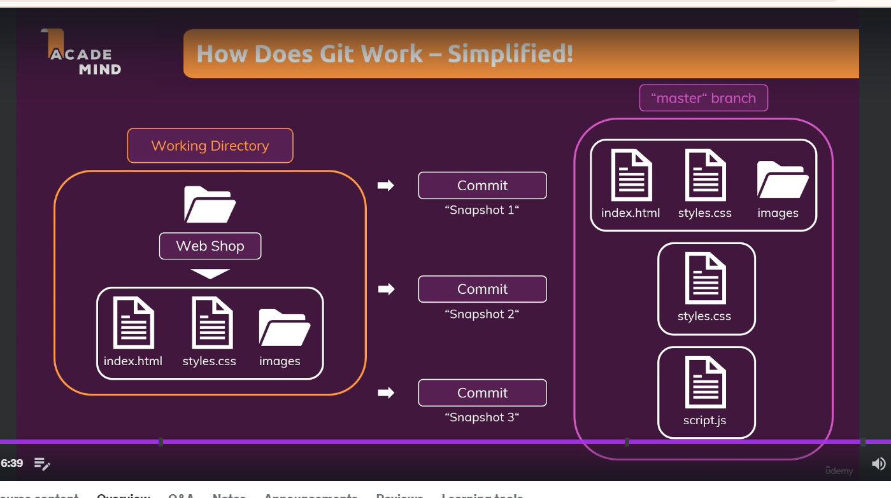

# Welcome to course

Git:

## version management with Git- the basics :

working directory - all files and folder which supposed to managed by git

commit - create snapshot of working directory

then we do some changes and commit then we can create another snapshot of it using commit

git stores by default all commits in master/main branch.

## working directory vs repository:

when we inialize then we create a hidden folder (.git) called git repository. this is where all version management magic happens.

repository contains two diiferent areas:
- staging area -> basically a index file 
- commit -> which is a object folder which contains different commits/snapshots

As part of commit creation, we first add changes (say we did in styles.css), to this staging area , we can think of it as 

